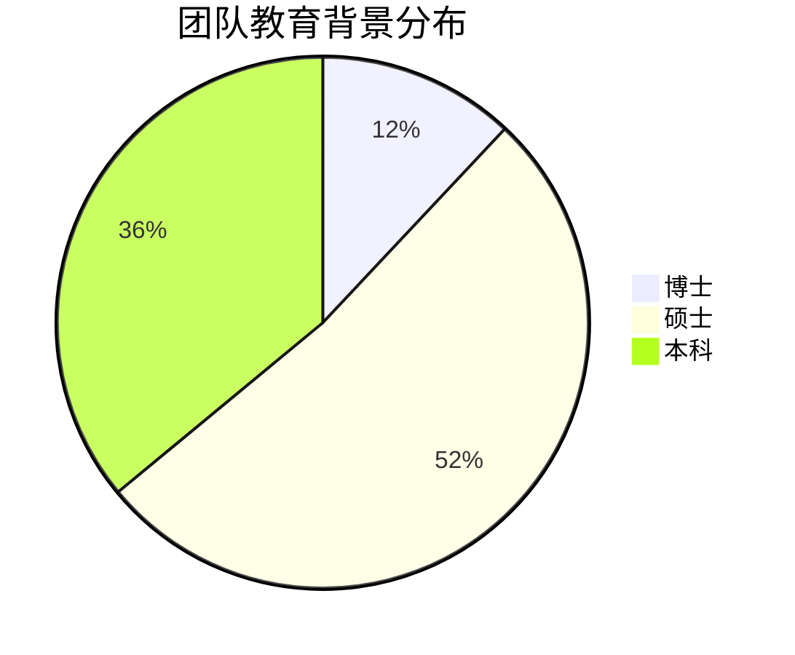

# 团队介绍

## 👥 核心团队

我们拥有一支经验丰富、充满激情的专业团队，团队成员来自全球知名科技公司和顶尖高校，在各自领域都有着深厚的技术积累和丰富的实战经验。

### 🎯 管理团队

#### 👨‍💼 CEO - 张伟 (Wei Zhang)

**教育背景**：
- 清华大学计算机科学博士
- 斯坦福大学访问学者

**工作经历**：
- 前阿里巴巴技术总监（2015-2020）
- 前微软亚洲研究院高级研究员（2010-2015）
- 10+年大型互联网公司管理经验

**专业领域**：
- 分布式系统架构
- 人工智能与机器学习
- 企业数字化转型

**个人成就**：
- 发表学术论文50+篇
- 获得发明专利20+项
- 入选"35岁以下科技创新35人"榜单

---

#### 👩‍💼 CTO - 李雪 (Snow Li)

**教育背景**：
- 北京大学软件工程硕士
- 卡内基梅隆大学计算机科学学士

**工作经历**：
- 前腾讯云架构师（2016-2021）
- 前Google软件工程师（2012-2016）
- 8+年云计算和大数据经验

**专业领域**：
- 云原生架构设计
- 大数据处理平台
- DevOps和自动化运维

**技术专长**：
```javascript
// 技术栈示例
const techStack = {
  languages: ['Go', 'Python', 'Java', 'JavaScript'],
  frameworks: ['Kubernetes', 'Docker', 'Spring Boot', 'Vue.js'],
  databases: ['PostgreSQL', 'MongoDB', 'Redis', 'Elasticsearch'],
  cloud: ['AWS', 'Azure', 'Alibaba Cloud', 'Google Cloud']
}
```

---

#### 👨‍💼 CPO - 王强 (Qiang Wang)

**教育背景**：
- 上海交通大学MBA
- 华中科技大学软件工程学士

**工作经历**：
- 前字节跳动产品总监（2017-2022）
- 前百度高级产品经理（2013-2017）
- 9+年互联网产品经验

**专业领域**：
- 产品战略规划
- 用户体验设计
- 数据驱动决策

**产品理念**：
> "好的产品不是功能的堆砌，而是用户需求的完美解决方案。"

---

#### 👩‍💼 CFO - 陈敏 (Min Chen)

**教育背景**：
- 中欧国际工商学院EMBA
- 复旦大学金融学硕士
- 注册会计师(CPA)

**工作经历**：
- 前小米集团财务总监（2018-2023）
- 前德勤咨询高级经理（2012-2018）
- 11+年财务管理经验

**专业领域**：
- 财务战略规划
- 投融资管理
- 风险控制
- 合规管理

### 🔬 技术团队

#### 🧠 AI研发团队

**团队规模**：25人
**团队负责人**：Dr. 刘博 (Bo Liu) - 前百度AI Lab首席科学家

**核心成员**：
- **算法工程师** × 15人
  - 深度学习、自然语言处理、计算机视觉专家
  - 平均工作经验5+年
  - 来自Google、Facebook、百度、阿里等知名公司

- **数据科学家** × 6人
  - 统计学、数学、计算机科学背景
  - 擅长数据挖掘和机器学习建模
  - 博士学历占比60%

- **AI工程师** × 4人
  - 负责AI模型的工程化和部署
  - 熟悉MLOps和模型服务化
  - 具备大规模系统开发经验

**技术栈**：
```python
# AI技术栈
ai_tech_stack = {
    'frameworks': ['TensorFlow', 'PyTorch', 'Transformers'],
    'languages': ['Python', 'C++', 'CUDA'],
    'tools': ['Jupyter', 'MLflow', 'Kubeflow', 'TensorBoard'],
    'cloud': ['AWS SageMaker', 'Azure ML', 'Google AI Platform']
}
```

#### 💻 后端开发团队

**团队规模**：30人
**团队负责人**：高级架构师 - 赵磊 (Lei Zhao)

**技术分工**：
- **微服务架构组** × 8人
  - Spring Boot、Spring Cloud专家
  - 分布式系统设计和优化
  - API网关和服务治理

- **数据库团队** × 6人
  - MySQL、PostgreSQL、MongoDB专家
  - 数据库性能优化和高可用设计
  - 分库分表和读写分离

- **中间件团队** × 8人
  - Redis、RabbitMQ、Kafka专家
  - 缓存策略和消息队列设计
  - 分布式锁和事务处理

- **DevOps团队** × 8人
  - Kubernetes、Docker、Jenkins专家
  - CI/CD流水线设计
  - 监控和日志系统

#### 🎨 前端开发团队

**团队规模**：20人
**团队负责人**：前端架构师 - 孙丽 (Li Sun)

**技术专长**：
- **Web前端组** × 12人
  - Vue.js、React、Angular专家
  - TypeScript和现代前端工程化
  - 组件库和设计系统开发

- **移动端组** × 8人
  - React Native、Flutter专家
  - iOS/Android原生开发
  - 跨平台解决方案

**技术栈**：
```json
{
  "frontend": {
    "frameworks": ["Vue 3", "React 18", "Angular 15"],
    "languages": ["TypeScript", "JavaScript", "Dart"],
    "tools": ["Vite", "Webpack", "ESLint", "Prettier"],
    "ui": ["Element Plus", "Ant Design", "Material UI"]
  },
  "mobile": {
    "frameworks": ["React Native", "Flutter", "Ionic"],
    "native": ["Swift", "Kotlin", "Objective-C", "Java"]
  }
}
```

### 🎯 产品团队

#### 📋 产品管理团队

**团队规模**：12人
**团队构成**：
- **高级产品经理** × 4人
- **产品经理** × 6人
- **产品助理** × 2人

**专业分工**：
- **B端产品线**：企业级解决方案
- **C端产品线**：消费者应用
- **平台产品线**：技术平台和工具
- **数据产品线**：数据分析和BI

#### 🎨 设计团队

**团队规模**：15人
**团队构成**：
- **UX设计师** × 6人
- **UI设计师** × 6人
- **交互设计师** × 3人

**设计理念**：
- **用户中心**：以用户需求为设计出发点
- **简约美观**：追求简洁而不简单的设计
- **一致性**：保持设计语言的统一性
- **可访问性**：确保产品的无障碍使用

### 🏢 职能团队

#### 💼 市场营销团队

**团队规模**：18人
**主要职能**：
- **品牌营销** × 4人：品牌建设和传播
- **数字营销** × 6人：线上推广和获客
- **内容营销** × 4人：内容创作和SEO
- **活动营销** × 4人：线下活动和会议

#### 🤝 销售团队

**团队规模**：25人
**销售区域**：
- **华北区** × 8人
- **华东区** × 10人
- **华南区** × 7人

**客户类型**：
- **大客户销售**：服务Fortune 500企业
- **中小企业销售**：服务成长型企业
- **渠道销售**：合作伙伴管理

#### 🎓 人力资源团队

**团队规模**：8人
**主要职能**：
- **招聘** × 3人：人才招聘和雇主品牌
- **培训发展** × 2人：员工培训和职业发展
- **薪酬福利** × 2人：薪酬体系和福利管理
- **员工关系** × 1人：员工关系和企业文化

## 📊 团队数据

### 👥 人员构成

| 部门 | 人数 | 占比 | 平均工作经验 |
|------|------|------|-------------|
| 技术研发 | 75 | 60% | 5.2年 |
| 产品设计 | 27 | 22% | 4.8年 |
| 市场销售 | 43 | 34% | 6.1年 |
| 职能支持 | 15 | 12% | 7.3年 |
| **总计** | **125** | **100%** | **5.6年** |

### 🎓 教育背景



### 🌍 地域分布

- **北京总部**：85人 (68%)
- **上海分公司**：20人 (16%)
- **深圳分公司**：15人 (12%)
- **海外团队**：5人 (4%)

### 📈 团队增长

| 年份 | 团队规模 | 增长率 |
|------|----------|--------|
| 2020 | 25人 | - |
| 2021 | 45人 | 80% |
| 2022 | 75人 | 67% |
| 2023 | 100人 | 33% |
| 2024 | 125人 | 25% |

## 🏆 团队文化

### 💡 核心理念

#### 🚀 创新精神
- **鼓励试错**：允许失败，从失败中学习
- **持续学习**：保持对新技术的敏感度
- **开放思维**：接受不同观点和建议

#### 🤝 协作文化
- **跨部门协作**：打破部门壁垒
- **知识分享**：定期技术分享和培训
- **团队建设**：丰富的团队活动

#### 🎯 结果导向
- **目标明确**：清晰的OKR目标管理
- **数据驱动**：基于数据做决策
- **持续改进**：不断优化工作流程

### 🎉 团队活动

#### 📚 学习发展
- **技术分享会**：每周五下午技术分享
- **读书会**：月度读书分享活动
- **外部培训**：支持员工参加外部培训
- **会议参与**：鼓励参加行业会议

#### 🎮 团建活动
- **季度团建**：户外拓展、聚餐等
- **年会庆典**：年度盛大庆祝活动
- **运动俱乐部**：篮球、羽毛球、跑步等
- **兴趣小组**：摄影、音乐、游戏等

## 🌟 加入我们

### 📋 招聘岗位

我们正在寻找以下岗位的优秀人才：

#### 🔬 技术岗位
- **高级后端工程师** (Java/Go/Python)
- **前端工程师** (Vue.js/React)
- **AI算法工程师** (机器学习/深度学习)
- **DevOps工程师** (Kubernetes/Docker)
- **数据工程师** (大数据/数据仓库)

#### 💼 非技术岗位
- **产品经理** (B端/C端产品)
- **UI/UX设计师**
- **市场营销专员**
- **销售经理**
- **人力资源专员**

### 💰 薪酬福利

#### 💵 薪酬体系
- **竞争性薪资**：行业领先的薪酬水平
- **股权激励**：核心员工股权计划
- **年终奖金**：根据个人和公司业绩
- **调薪机制**：年度调薪和晋升机会

#### 🎁 福利待遇
- **五险一金**：按最高标准缴纳
- **补充医疗**：商业医疗保险
- **带薪年假**：15-25天年假
- **弹性工作**：灵活的工作时间
- **免费三餐**：营养丰富的工作餐
- **健身房**：公司内部健身设施
- **学习基金**：年度学习发展预算

### 📧 应聘方式

**简历投递**：hr@company.com
**邮件标题**：应聘岗位-姓名-工作经验
**简历要求**：
- PDF格式，文件大小不超过5MB
- 包含个人信息、教育背景、工作经历
- 技术岗位请附上GitHub或作品链接

---

::: tip 人才理念
我们相信人才是公司最宝贵的财富。我们致力于为每一位员工提供成长的平台和发展的机会，让每个人都能在这里实现自己的职业理想。
:::

::: info 联系我们
如果您对我们的团队感兴趣，或者想了解更多信息，请随时联系我们：
- 📧 邮箱：hr@company.com
- 📞 电话：+86-10-8888-8888
- 💬 微信：扫描二维码添加HR微信
:::