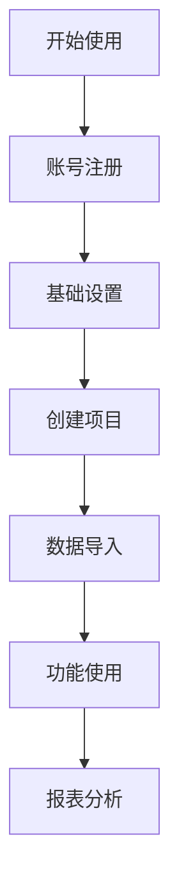

# 文档中心

欢迎来到我们的文档中心！这里提供了完整的产品文档、API参考、开发指南和最佳实践，帮助您快速上手并充分利用我们的产品和服务。

## 📚 文档导航

### 🚀 快速开始

如果您是第一次使用我们的产品，建议从这里开始：

- **[快速入门指南](/docs/getting-started)** - 5分钟快速体验
- **[安装部署](/docs/installation)** - 详细的安装步骤
- **[基础配置](/docs/configuration)** - 基本配置说明
- **[第一个项目](/docs/first-project)** - 创建您的第一个项目

### 📖 用户指南

详细的功能使用说明：

- **[用户管理](/docs/user-guide/user-management)** - 用户注册、登录、权限管理
- **[项目管理](/docs/user-guide/project-management)** - 项目创建、配置、协作
- **[数据管理](/docs/user-guide/data-management)** - 数据导入、处理、分析
- **[报表分析](/docs/user-guide/analytics)** - 数据可视化和报表生成
- **[系统设置](/docs/user-guide/settings)** - 系统配置和个性化设置

### 🔧 开发者文档

面向开发者的技术文档：

- **[API参考](/docs/api)** - 完整的API文档
- **[SDK文档](/docs/sdk)** - 多语言SDK使用指南
- **[Webhook](/docs/webhooks)** - 事件通知机制
- **[插件开发](/docs/plugins)** - 自定义插件开发
- **[集成指南](/docs/integrations)** - 第三方系统集成

### 🏗️ 架构设计

系统架构和设计理念：

- **[系统架构](/docs/architecture/overview)** - 整体架构设计
- **[数据库设计](/docs/architecture/database)** - 数据模型和关系
- **[安全架构](/docs/architecture/security)** - 安全设计和最佳实践
- **[性能优化](/docs/architecture/performance)** - 性能调优指南

## 🎯 按角色分类

### 👤 最终用户

如果您是产品的最终用户：



**推荐阅读顺序**：
1. [快速入门指南](/docs/getting-started)
2. [用户界面介绍](/docs/user-guide/interface)
3. [基本操作流程](/docs/user-guide/workflow)
4. [常见问题解答](/docs/faq)

### 👨‍💼 管理员

如果您是系统管理员：

**核心职责**：
- 用户和权限管理
- 系统配置和维护
- 数据备份和恢复
- 性能监控和优化

**推荐文档**：
- [管理员指南](/docs/admin-guide)
- [用户权限管理](/docs/admin-guide/permissions)
- [系统监控](/docs/admin-guide/monitoring)
- [备份恢复](/docs/admin-guide/backup)

### 👨‍💻 开发者

如果您是开发者或技术集成人员：

**开发流程**：
```javascript
// 开发流程示例
const developmentFlow = {
  step1: '阅读API文档',
  step2: '获取API密钥',
  step3: '环境搭建',
  step4: '编写代码',
  step5: '测试验证',
  step6: '部署上线'
}
```

**推荐文档**：
- [API快速开始](/docs/api/quickstart)
- [认证授权](/docs/api/authentication)
- [SDK使用指南](/docs/sdk)
- [代码示例](/docs/examples)

## 📋 文档类型

### 📘 教程 (Tutorials)

循序渐进的学习教程：

- **[新手教程](/docs/tutorials/beginner)** - 零基础入门
- **[进阶教程](/docs/tutorials/advanced)** - 高级功能使用
- **[实战案例](/docs/tutorials/case-studies)** - 真实项目案例
- **[视频教程](/docs/tutorials/videos)** - 视频演示

### 📖 指南 (Guides)

解决特定问题的指南：

- **[最佳实践](/docs/guides/best-practices)** - 推荐的使用方式
- **[故障排除](/docs/guides/troubleshooting)** - 常见问题解决
- **[性能优化](/docs/guides/optimization)** - 性能提升技巧
- **[安全指南](/docs/guides/security)** - 安全使用建议

### 📚 参考 (Reference)

详细的技术参考资料：

- **[API参考](/docs/api)** - 完整的API文档
- **[配置参考](/docs/reference/configuration)** - 所有配置选项
- **[错误代码](/docs/reference/error-codes)** - 错误代码说明
- **[术语表](/docs/reference/glossary)** - 专业术语解释

### 📝 说明 (Explanations)

深入的概念解释：

- **[设计理念](/docs/explanations/design-philosophy)** - 产品设计思路
- **[技术选型](/docs/explanations/technology-stack)** - 技术栈说明
- **[架构决策](/docs/explanations/architecture-decisions)** - 架构设计决策

## 🔍 搜索和导航

### 🔎 文档搜索

使用搜索功能快速找到所需信息：

- **全文搜索**：支持中英文搜索
- **标签筛选**：按标签分类筛选
- **版本筛选**：查看特定版本文档
- **搜索建议**：智能搜索建议

### 🗂️ 文档分类

按不同维度组织的文档：

| 分类 | 描述 | 适用人群 |
|------|------|----------|
| 入门 | 基础概念和快速开始 | 新用户 |
| 进阶 | 高级功能和深度使用 | 有经验用户 |
| 开发 | API和技术集成 | 开发者 |
| 管理 | 系统管理和运维 | 管理员 |
| 案例 | 实际应用案例 | 所有用户 |

## 📱 多平台支持

### 💻 Web端文档

- **响应式设计**：适配各种屏幕尺寸
- **离线阅读**：支持离线缓存
- **夜间模式**：护眼的深色主题
- **字体调节**：可调节字体大小

### 📱 移动端

- **移动优化**：针对移动设备优化
- **触摸友好**：适合触摸操作
- **快速加载**：优化加载速度
- **离线支持**：关键文档离线可用

### 📄 PDF下载

- **完整文档**：提供PDF版本下载
- **章节下载**：支持单独章节下载
- **打印友好**：优化打印格式
- **版本标记**：包含版本和更新时间

## 🔄 文档更新

### 📅 更新频率

- **产品更新**：随产品版本同步更新
- **内容优化**：持续改进文档质量
- **用户反馈**：根据用户反馈及时更新
- **定期审查**：定期审查和更新过时内容

### 📢 更新通知

- **更新日志**：详细的更新记录
- **邮件通知**：重要更新邮件提醒
- **RSS订阅**：支持RSS订阅更新
- **社交媒体**：通过社交媒体发布更新

## 💬 获得帮助

### 🤝 社区支持

- **开发者社区**：[community.company.com](https://community.company.com)
- **技术论坛**：技术问题讨论
- **用户群组**：用户交流群
- **专家答疑**：定期专家在线答疑

### 📞 技术支持

- **在线客服**：7×24小时在线支持
- **技术热线**：+86-10-8888-8889
- **邮件支持**：support@company.com
- **远程协助**：提供远程技术支持

### 📝 反馈建议

- **文档反馈**：每页底部的反馈按钮
- **改进建议**：docs-feedback@company.com
- **错误报告**：发现错误请及时报告
- **内容贡献**：欢迎贡献文档内容

---

::: tip 使用建议
- 建议先阅读快速入门指南了解基本概念
- 根据您的角色选择相应的文档分类
- 善用搜索功能快速定位所需信息
- 遇到问题时先查看FAQ和故障排除指南
:::

::: info 文档贡献
我们欢迎社区贡献文档内容！如果您发现错误或希望改进文档，请通过GitHub提交PR或联系我们的文档团队。
:::

::: warning 版本说明
请注意文档版本与产品版本的对应关系，确保查看的是正确版本的文档。过时的文档可能包含不准确的信息。
:::