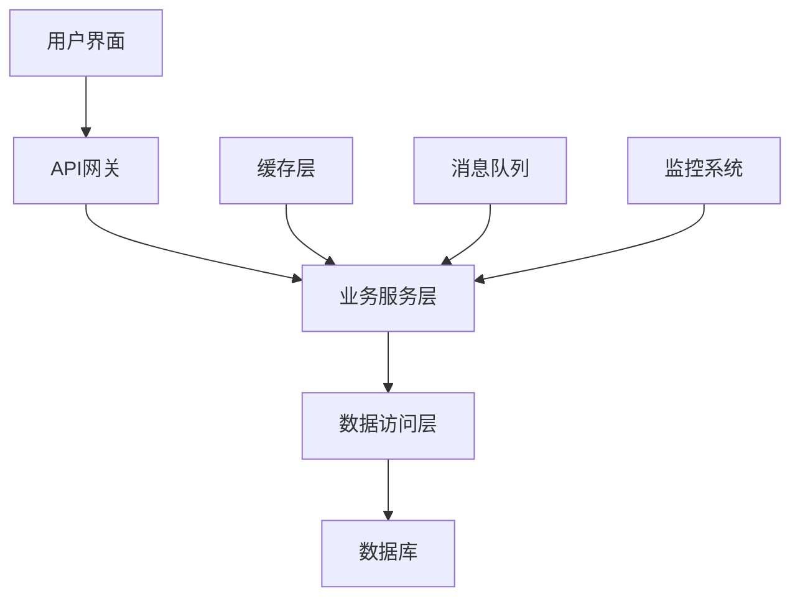

# 产品介绍

## 🌟 产品概述

我们的产品是一款基于现代化技术栈开发的解决方案，旨在为用户提供高效、稳定、易用的服务体验。

## 🎯 核心价值

### 高效性能
- **快速响应**：毫秒级响应时间
- **高并发支持**：支持大规模用户同时访问
- **智能缓存**：多层缓存机制确保最佳性能

### 稳定可靠
- **99.9%可用性**：企业级稳定性保障
- **自动容错**：智能故障检测和恢复
- **数据安全**：多重安全防护机制

### 易于使用
- **直观界面**：简洁明了的用户界面
- **快速上手**：5分钟快速入门
- **丰富文档**：详细的使用指南和API文档

## 🏗️ 技术架构



## 📊 产品规格

| 特性 | 规格 | 说明 |
|------|------|------|
| 支持用户数 | 100万+ | 同时在线用户数 |
| 响应时间 | <100ms | 平均API响应时间 |
| 数据处理 | 1TB/天 | 日数据处理能力 |
| 可用性 | 99.9% | 年度可用性保障 |

## 🎨 产品截图

::: tip 演示环境
您可以访问我们的[演示环境](https://demo.example.com)体验产品功能。
:::

## 🚀 快速开始

1. **注册账号**
   ```bash
   # 访问注册页面
   https://your-domain.com/register
   ```

2. **配置环境**
   ```javascript
   // 基础配置
   const config = {
     apiUrl: 'https://api.your-domain.com',
     timeout: 5000,
     retries: 3
   }
   ```

3. **开始使用**
   ```javascript
   // 初始化SDK
   import { YourSDK } from '@your-company/sdk'
   
   const client = new YourSDK(config)
   await client.init()
   ```

## 💡 使用场景

### 企业级应用
- 大型企业内部管理系统
- 客户关系管理(CRM)
- 企业资源规划(ERP)

### 互联网应用
- 电商平台
- 社交媒体
- 内容管理系统

### 移动应用
- iOS/Android原生应用
- 混合应用开发
- 小程序开发

## 🔄 版本历史

### v2.0.0 (最新版本)
- 🎉 全新UI设计
- ⚡ 性能提升50%
- 🔧 新增批量操作功能
- 🐛 修复已知问题

### v1.5.0
- 📱 移动端适配优化
- 🔐 安全性增强
- 📊 新增数据分析功能

### v1.0.0
- 🚀 首个正式版本发布
- 🎯 核心功能完整实现

---

::: warning 注意
产品正在持续迭代中，建议关注我们的[更新日志](/docs/changelog)获取最新信息。
:::