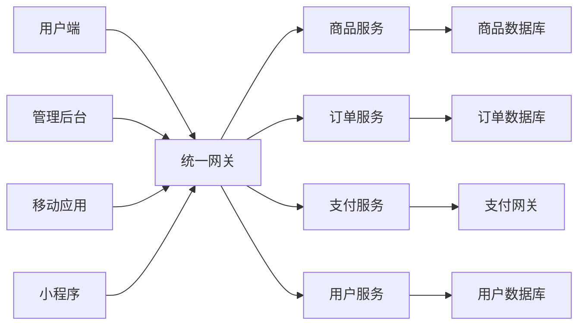

# 解决方案

## 🎯 行业解决方案

我们为不同行业提供定制化的解决方案，帮助企业实现数字化转型和业务增长。

### 🏢 企业级解决方案

#### 大型企业数字化转型
- **现状分析**：传统企业面临数字化转型挑战
- **解决方案**：
  - 统一数据平台建设
  - 业务流程数字化改造
  - 智能决策支持系统
  - 员工协作平台
- **预期效果**：
  - 运营效率提升40%
  - 决策速度提升60%
  - 成本降低25%

#### 中小企业快速成长
- **痛点识别**：资源有限，需要快速扩展
- **解决方案**：
  - 云原生架构设计
  - 敏捷开发流程
  - 自动化运维体系
  - 弹性扩容机制
- **价值体现**：
  - 上线时间缩短70%
  - 运维成本降低50%
  - 系统稳定性99.9%

### 🛒 电商行业解决方案

#### 全渠道电商平台


**核心功能**：
- 🛍️ **商品管理**：SKU管理、库存同步、价格策略
- 📦 **订单处理**：订单流转、物流跟踪、售后服务
- 💳 **支付集成**：多种支付方式、风控系统
- 👥 **用户运营**：会员体系、营销活动、客户服务

**技术特点**：
- 微服务架构，支持高并发
- 分布式缓存，毫秒级响应
- 智能推荐算法
- 实时数据分析

### 🏥 医疗健康解决方案

#### 智慧医院管理系统
- **患者管理**：
  - 电子病历系统
  - 预约挂号平台
  - 移动支付结算
  - 健康档案管理

- **医生工作站**：
  - 诊疗辅助系统
  - 医学影像查看
  - 处方开具系统
  - 医患沟通平台

- **医院运营**：
  - 资源调度优化
  - 设备管理系统
  - 财务管理系统
  - 质量控制体系

### 🎓 教育行业解决方案

#### 在线教育平台
- **学习管理系统(LMS)**：
  ```javascript
  // 课程进度跟踪
  const courseProgress = {
    courseId: 'course-123',
    studentId: 'student-456',
    completedLessons: 15,
    totalLessons: 20,
    progress: 75,
    lastAccessTime: '2024-01-15T10:30:00Z'
  }
  ```

- **互动教学工具**：
  - 实时视频直播
  - 在线白板协作
  - 作业提交系统
  - 考试评测平台

- **数据分析**：
  - 学习行为分析
  - 成绩统计报告
  - 教学效果评估
  - 个性化学习路径

## 🔧 技术解决方案

### ☁️ 云原生架构

#### 容器化部署
```yaml
# Kubernetes部署配置
apiVersion: apps/v1
kind: Deployment
metadata:
  name: web-app
spec:
  replicas: 3
  selector:
    matchLabels:
      app: web-app
  template:
    metadata:
      labels:
        app: web-app
    spec:
      containers:
      - name: web-app
        image: your-registry/web-app:latest
        ports:
        - containerPort: 8080
        env:
        - name: DATABASE_URL
          valueFrom:
            secretKeyRef:
              name: db-secret
              key: url
```

#### 微服务架构
- **服务拆分**：按业务域拆分服务
- **API网关**：统一入口和路由
- **服务发现**：自动服务注册和发现
- **配置管理**：集中化配置管理
- **监控告警**：全链路监控体系

### 📊 大数据解决方案

#### 数据湖架构
```python
# 数据处理流水线示例
from pyspark.sql import SparkSession

spark = SparkSession.builder \
    .appName("DataProcessing") \
    .getOrCreate()

# 读取原始数据
raw_data = spark.read.json("s3://data-lake/raw/")

# 数据清洗和转换
cleaned_data = raw_data \
    .filter(raw_data.status == "active") \
    .select("id", "name", "timestamp", "value")

# 写入数据仓库
cleaned_data.write \
    .mode("overwrite") \
    .parquet("s3://data-lake/processed/")
```

#### 实时数据处理
- **流式计算**：Apache Kafka + Apache Flink
- **实时分析**：ClickHouse + Grafana
- **机器学习**：TensorFlow + Kubeflow
- **数据可视化**：Apache Superset

### 🔐 安全解决方案

#### 零信任安全架构
- **身份验证**：多因子认证(MFA)
- **设备信任**：设备指纹识别
- **网络隔离**：微分段网络
- **持续监控**：行为分析和威胁检测

#### 数据保护
- **数据分类**：敏感数据自动识别
- **加密存储**：端到端加密
- **访问控制**：细粒度权限管理
- **合规审计**：GDPR、CCPA合规

## 📈 成功案例

### 案例一：某大型零售企业

**项目背景**：
- 传统零售企业，拥有1000+门店
- 线上线下数据孤岛严重
- 库存管理效率低下

**解决方案**：
- 构建统一数据平台
- 实现全渠道库存管理
- 部署智能补货系统
- 建设客户画像系统

**项目成果**：
- 库存周转率提升35%
- 缺货率降低60%
- 客户满意度提升25%
- ROI达到300%

### 案例二：某金融科技公司

**项目背景**：
- 快速发展的金融科技公司
- 需要处理海量交易数据
- 对系统稳定性要求极高

**解决方案**：
- 微服务架构重构
- 分布式数据库设计
- 实时风控系统
- 自动化运维平台

**项目成果**：
- 系统可用性达到99.99%
- 交易处理能力提升10倍
- 风控响应时间<50ms
- 运维效率提升80%

## 🚀 实施流程

### 第一阶段：需求分析（1-2周）
1. **业务调研**：深入了解业务需求
2. **技术评估**：现有系统技术评估
3. **方案设计**：定制化解决方案设计
4. **项目规划**：制定详细项目计划

### 第二阶段：系统开发（4-12周）
1. **环境搭建**：开发测试环境准备
2. **核心开发**：核心功能模块开发
3. **集成测试**：系统集成和测试
4. **性能优化**：系统性能调优

### 第三阶段：部署上线（1-2周）
1. **生产部署**：生产环境部署
2. **数据迁移**：历史数据迁移
3. **用户培训**：用户操作培训
4. **试运行**：系统试运行验证

### 第四阶段：运维支持（持续）
1. **监控运维**：7×24小时监控
2. **问题处理**：快速响应和处理
3. **版本升级**：定期版本更新
4. **优化改进**：持续优化改进

---

::: tip 联系我们
想了解更多解决方案详情？请[联系我们的专家团队](/about/contact)，我们将为您提供免费的咨询服务。
:::

::: warning 定制开发
以上解决方案可根据您的具体需求进行定制开发。项目周期和费用会根据实际需求确定。
:::